# Developer Guide
## SDK Package Download
Guidance SDK is maintained and updated on GitHub.

- [GuidanceSDK](https://github.com/dji-sdk/GuidanceSDK): the complete package, including header file, library files on all platforms, and all documents.
- [GuidanceSDKROS](https://github.com/dji-sdk/GuidanceSDKROS): the ROS package, including header file, library files on Ubuntu and Odroid XU3.

## Environment Setup
### Windows
#### Install “Guidance Assistant” Software
Install “Guidance Assistant” software firstly, which provides the USB driver under Windows platform. Restart your PC after installation, there will be **“DJI, Inc. - Guidance”** in Device Manager when Guidance is powered and connected to PC, which indicates the installation is successful.

  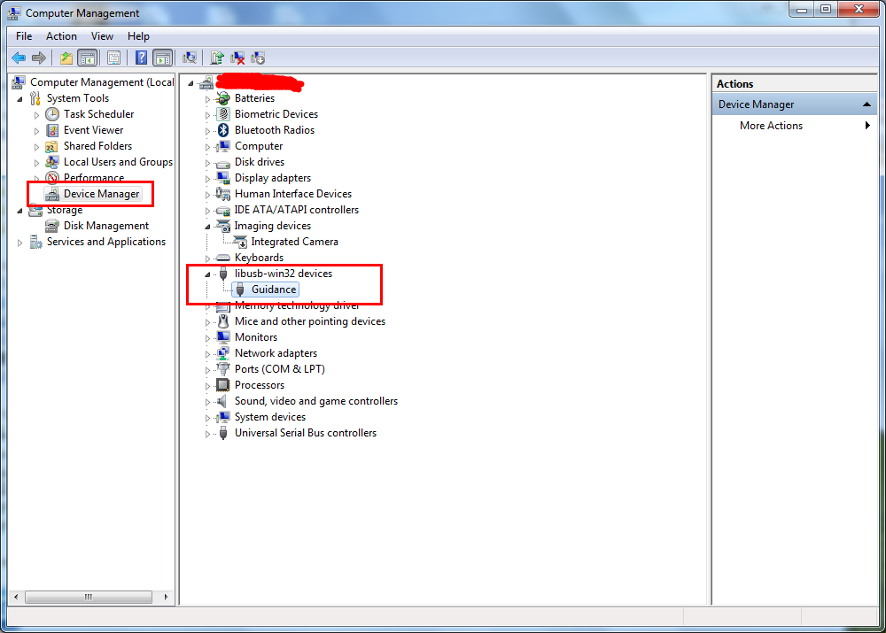 

 ---

#### Install UART Driver
Install **USB\_TO\_RS232** driver if you want to use SDK via UART. Notice that Guidance SDK reads port **“COM5”** by default.

---

#### Activate and Subscribe Data
>*Assume that “Guidance Assistant” software has been correctly installed on Windows.* 

-	Connect Guidance to PC and power it on. Open the “Guidance Assistant” software, wait until the light on the left-bottom green up and switch to **“DIY”** mode on the **view** page.

  

-	Then change to **DIY** page, activate **USB** or **UART**, and subscribe the data you want.

>*Notice: You can also subscribe data by API functions provided by the SDK package.*

 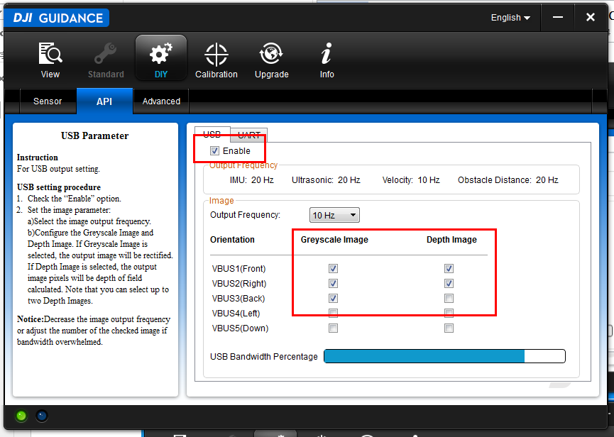 

 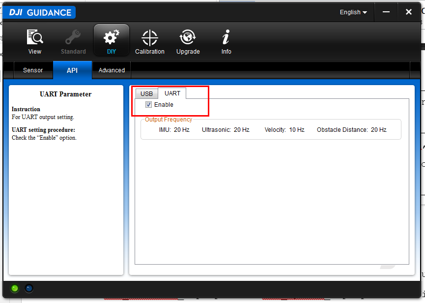 

-	Close the software and restart Guidance to enable configure works. 

>*Notice: If you do not close the software Guidance Assistant, you will not be able to use Guidance SDK as the connection to Guidance Core is occupied.* 

---

#### Visual Studio Is Recommended
We provide a bunch of property sheet files \*.prop including **“use\_Guidance\_\*.prop”** and **“use\_opencv\_\*.prop”** under Visual Studio 2010/2013, which are well tested on Win7 x86/x64, you could simply add them to your project. Of course, just choose whatever compiler you like.

---

#### Install OpenCV
Opencv2.4.8/9/11 are well tested with Guidance SDK, you can download the version you like from http://opencv.org/. 
>*Notice that we define $(OPENCVROOT) as a variable of OpenCV path in the provided example and Demo projects, therefore it is suggested to add a variable named OPRNCVROOT in computer environment variable for the ease of use.*

For example: 
>*Suppose the installed directory of Opencv2.4.11 in your computer is D:/OPENCV/opencv2411/build[sources].* 

-	Add **$(OPENCVROOT)** to your environment variables, i.e., create an environment variable, whose name is **OPENCVROOT** and value is **D:/OPENCV/opencv2411/**.

 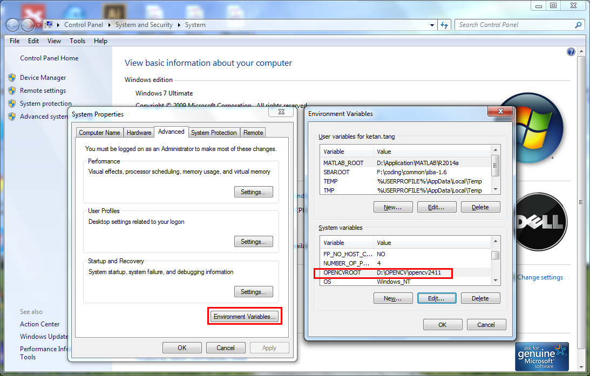 

- Then add the OpenCV bin path to your environment path. You should tails the follows to variable Path: 
**D:/OPENCV/opencv2411/build/x64/vc10/bin;** 
**D:/OPENCV/opencv2411/build/x86/vc10/bin;**    
-	If you use visual studio as development environment, just add **“use\_Guidance\_\*.prop”** and **“use\_opencv\_\*.prop”** provided by SDK example to your project. Otherwise, remember to add the path of .dll, .lib, .h of Guidance SDK and OPENCV to your project. 

---

#### Place DJI\_guidance.dll Properly
Remember to copy corresponding DJI\_guidance.dll to **/PATH/TO/YOUR/EXE**. Of course .dll, .h and .lib should be placed at correct places too.

  

---

### Linux
#### Install USB Driver
Download and unzip “libusb-1.0.9.tar.bz2” file from http://www.libusb.org/ , and install it correctly by instruction. Install from `apt-get` is not recommended.

For example, unzip libusb-1.0.9.tar.bz2 first and` cd `to **PATH/TO/LIBUSB\_DIR**, then

	>> ./configure
	>> make
	>> make install

---

#### Install UART Driver
Linux includes **USB** to **UART** driver by default. 

---

#### Activate and Subscribe Data 
Refers to **Install “Guidance Assistant” software** in Windows

---
 
#### Update g++ Compiler To Latest 
Make sure the g++ compiler on your computer is the latest version, check the time on your computer synchrony to real-world! 

For example:

	>> sudo apt-get install g++

---

#### Install OpenCV
- You can use apt-get to install opencv: 

		>> sudo apt-get install libopencv-dev

- Or make from source. 
- Or, you can download the **Install-OpenCV-master** from GitHub, which is provided by jayrambhia. There are shell scripts in it to install different version of OpenCV in different distributions of Linux. One can install OpenCV by use these scripts easily. 

For example:

	>> cd PATH/TO/Install-OpenCV-master/Ubuntu 
	>> ./dependencies.sh 
	>> cd 2.4
	>> ./opencv2_4_9.sh

---

#### Place DJI\_guidance.so Properly
Copy corresponding **libDJI\_guidance.so** to **/usr/local/lib**.

For example: 

	>> sudo cp libDJI_guidance.so /usr/local/lib

---

#### Run by sudo
- When using the USB port of Guidance SDK, `sudo` command is required to get root privilege of USB port, otherwise an error of *permission denied* will occur. For example:

		>> sudo ./guidance_example

- To save the trouble of using `sudo` every time you run Guidance SDK programs, you can also create a file `51-guidance.rules` in `/etc/udev/rules.d/` with the following content:

		SUBSYSTEM=="usb", ATTR{idVendor}=="18d1", ATTR{idProduct}=="d009", MODE="0666"
Then disconnect and connect again USB cable of Guidance Core. Now you will be able to run Guidance SDK programs without `sudo`.

## Common Errors
>**Set up your environment according to the steps in Developer Guide can avoid most of the errors.**
### Connection error
***Description:*** 
**“usb error”** or things like that happen, for example:

  

***Solution:***

-	Make sure Guidance has been connected to PC and green light on Guidance Sensor starts to flicker.
- 	Check whether USB driver is installed correctly, look up **“Device Manager”** on Windows platform. Otherwise install it by construction in Developer Guide.
-	Check if UART port is **“COM5”** or you set before.
-	Check if you activated and subscribed the data via “Guidance Assistant” software, and Guidance is set to **“custom mode”**, otherwise refers to Developer Guide.
-	Restart the Guidance, if quit improperly last time, i.e. the data transfer thread quit before **stop\_transfer()** and **release\_transfer()**.
-	Remember to run program by `sudo` in Linux.
-	Do not run your program until the green light on Guidance Sensor starts to flicker. 
-	Make sure “Guidance Assistant” software is closed when you are using SDK.
-	Errors happened at times when running on a virtual machine.  

---

### Build error
#### Error while loading shared libraries
***Description:***

	Error while loading shared libraries : libDJI_guidance.so: cannot open shared object file : No such file or directory.

***Solution:***

-	Make sure that the corresponding **DJI\_guidance.so** is placed in the library path (eg **/usr/local/lib**), or copy **DJI\_guidance.so** to **/PATH/TO/RUNPATH** if it doesn’t work.
-	Make sure **DJI\_guidance.so** is compatible to your system.

---

#### Cannot open DJI\_guidance.dll file
***Description:***

	Cannot open DJI_guidance.dll file:No such file or directory.

***Solution:*** 
Make sure that corresponding **DJI\_guidance.dll** is placed in the RUNPATH.

---

#### OpenCV related error
***Description:***

	Cannot open OpenCV related *.h or *.dll.

***Solution:***

Check the configuration of OpenCV, remember that we use **$(OPENCVROOT)** as an environment variable in examples.

---

### Data transfer error
***Description:***

Data transfer error occurs means you may get a wrong image, for example:

   

***Solution:*** 

-	Check your code first and test Guidance on provided examples.
-	Restart Guidance, run your program after green light on Guidance start to flicker, and be sure end your program properly with **stop\_transfer()** and **release\_transfer()**.

---
 
## How to build a visual tracking project

This tutorial gives an example of building a visual tracking project using Guidance SDK step by step. 

---

### Download and unzip SDK
Latest version of SDK is available on GitHub: https://github.com/dji-sdk

The content includes：

-	**demo**: a visual tracking project by using Guidance SDK
-	**doc**: API details
-	**examples**: examples for USB, UART and ROS
-	**include**: Header file of Guidance SDK 
-	**lib**: Library files for Windows
-	**so**: Library files for Linux

Unzip the SDK.
 
  

 Figure.1 SDK overview 

---

### Create a project from scratch
#### Windows
##### 1 Create a project named “guidanceSDK\_test”
Create an empty project in VS2010 in directory **“SDK/demo”** named **“guidanceSDK\_test”**.
 
  

 Figure.2 Create an empty project named “guidanceSDK\_test” 
 

   

 Figure.4 Create the project in “SDK\demo”  

---

##### 2 Add .h and .cpp to project
###### 2.1 Add main.cpp
Add an empty **main.cpp** to project first.

---

###### 2.2 Add DJI\_utility.h and DJI\_utility.cpp
Copy the thread security related files **DJI\_utility.cpp** and **DJI\_utility.h** to the same directory as **main.cpp**, and add them in vs2010. (DJI\_utility.cpp and DJI\_utility.h can be found both in **SDK/demo** and **SDK/examples**)
 
  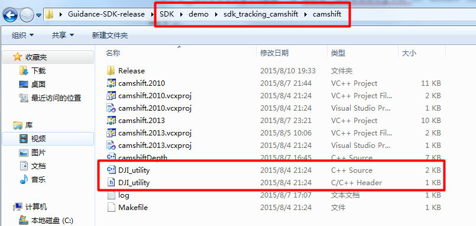 

 Figure.5 DJI\_utility files in demo/sdk\_tracking\_camshift/camshift 

  

 Figure.6 Copy DJI\_utility files to project path 

   

 Figure.7 Add DJI\_utility files to project in vs2010 

---

###### 2.3 Configure the Include and Library path
There are **DJI\_guidance.h**, **DJI\_guidance.lib** and **OpenCV** related path needed to configure；
**DJI\_guidance.h** is in **SDK/include**, **DJI\_guidance.lib** is in **SDK/lib**, the path of them should be added in vs2010. **DJI\_guidance.lib** in **SDK/lib/2010/x86** is going to be used here as we will run programs in **Release | Win32** mode.
 
  

 Figure.8 DJI\_guidance.h is in SDK/include 

   

 Figure.9 Release | Win32 mode 

   

 Figure.10 DJI\_guidance.lib in SDK/lib/2010/x86 is used here 

To simplify the configuration, we can simply copy the property sheets
**“use\_opencv\_release\_vs2010\_x86.prop”** 
**“use\_Guidance\_vs2010\_x86.prop”** 
in **SDK/demo/sdk\_tracking\_camshift** to our project. 

 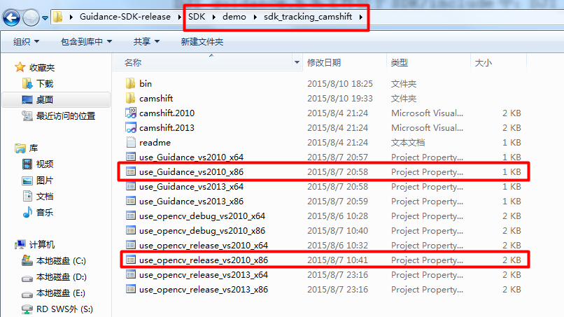 

 Figure.11 Copy corresponding *.prop in sdk\_tracking\_camshift 

   

 Figure.12 Copy corresponding *.prop to the same directory as guidanceSDK\_test.sln  

Switch the toolbar to **“Property Manager”** as shown below. Right-click the **Release | Win32**, and click the **“Add Existing Property Sheet”**， then add:
**“use\_opencv\_release\_vs2010\_x86.prop”**
**“use\_Guidance\_vs2010\_x86.prop”** 
to our project.
 
  

 Figure.13 Add *.prop to our project 
 
  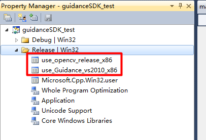 

 Figure.14 Configuration is down 

>*Attention: Make sure you have set up the experiment environment properly, and installed OpenCV.*

Users can modify the property sheet to adapt to changes of the path of project. Here gives a look at the path of Include and Library of Guidance SDK. 
 
  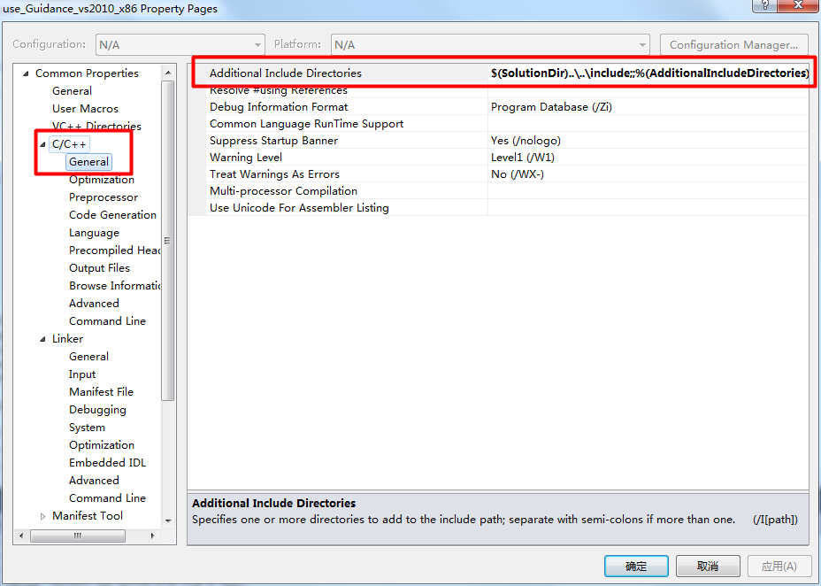 

 Figure.15 Include path of Guidance SDK in“use\_Guidance\_vs2010\_x86.prop” 

  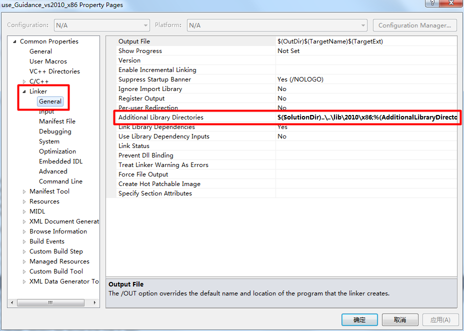 

 Figure.16  Library path of Guidance SDK in “use\_Guidance\_vs2010\_x86.prop” 

---

##### 3 Configure dynamic library
Copy the DJI\_guidance.dll in **SDK/lib/2010/x86** to bin of our project.
 
   

 Figure.17 Release | Win32 mode 

   

 Figure.18 Path of *.dll and *.lib 

Copy **DJI\_guidance.dll** to bin, which is in the same directory as **guidanceSDK\_test.sln**.

   

 Figure.19 Copy corresponding DJI\_guidance.dll to bin 

---

##### 4 Edit main.cpp
- 	Add the necessary headers to **main.cpp** first. **DJI\_guidance.h** is for Guidance SDK, **DJI\_utility.h** is for thread security, and **opencv** related headers are for image processing. 

		#include "opencv2/video/tracking.hpp"
		#include "opencv2/imgproc/imgproc.hpp"
		#include "opencv2/highgui/highgui.hpp"
		#include "opencv2/calib3d/calib3d.hpp"	
		#include <fstream>
		#include <iostream>
		#include "DJI_guidance.h"
		#include "DJI_utility.h"
		
		using namespace cv;
		using namespace std;

- Declare global variables that will be used in different threads. **Image** stores the data transferred and the result, **g\_lock** provides thread security functions, **g\_event** gives the method to respond to data transfer event, **selection** is declared for user to select object to track, **WIDTH**, **HEIGHT** and **IMAGE\_SIZE** are the size of the images. 

		Mat image;
		
		bool selectObject = false;
		int trackObject = 0;
		Point origin;
		Rect selection;
		DJI_event g_event;
		DJI_lock g_lock;
		
		#define WIDTH 320
		#define HEIGHT 240
		#define IMAGE_SIZE (HEIGHT * WIDTH)

- Then define an object selection function using mouse, which enables users to easyly select the object to track at the beginning of data transfer. 

		static void onMouse( int event, int x, int y, int, void* )
		{
		    	if( selectObject )
		    	{
		        	selection.x = MIN(x, origin.x);
		        	selection.y = MIN(y, origin.y);
		        	selection.width = std::abs(x - origin.x);
		        	selection.height = std::abs(y - origin.y);
		
		        	selection &= Rect(0, 0, image.cols, image.rows);
		    	}
		
		    	switch( event )
		    	{
		    	case CV_EVENT_LBUTTONDOWN:
		        	origin = Point(x,y);
		        	selection = Rect(x,y,0,0);
		        	selectObject = true;
		        	break;
		    	case CV_EVENT_LBUTTONUP:
		        	selectObject = false;
		        	if( selection.width > 0 && selection.height > 0 )
		           	trackObject = -1;
		        	break;
		    	}
		}

- Here provides a help function, which is for showing the information of how this program works in the mode of Windows Console. User can get the help information as follows:

		guidanceSDK_test.exe -h
Help function prototype: 

		static void help()
		{
		    	cout << "\nThis is a demo that shows camshift based tracking with Guidance.\n"
		              "You select an objects such as your face and it tracks it.\n"
		              "This reads from greyscale and depth images from DJI Guidance.\n"
		              "Usage: \n"
		              "   ./camshift.exe\n";
		
		    	cout << "\n\nHot keys: \n"
		              "\tESC/q - quit the program\n"
		              "\tc - stop the tracking\n"
		              "\tb - switch to/from backprojection view\n"
		              "\tp - pause video\n"
		              "To initialize tracking, select the object with mouse\n";
		}
Since this tutorial gives a demo of camshift based tracking using depth image, users need to select object to track when the program starts with the window of **“Guidance Tracking Demo”**, and then the result will be shown. 
 
 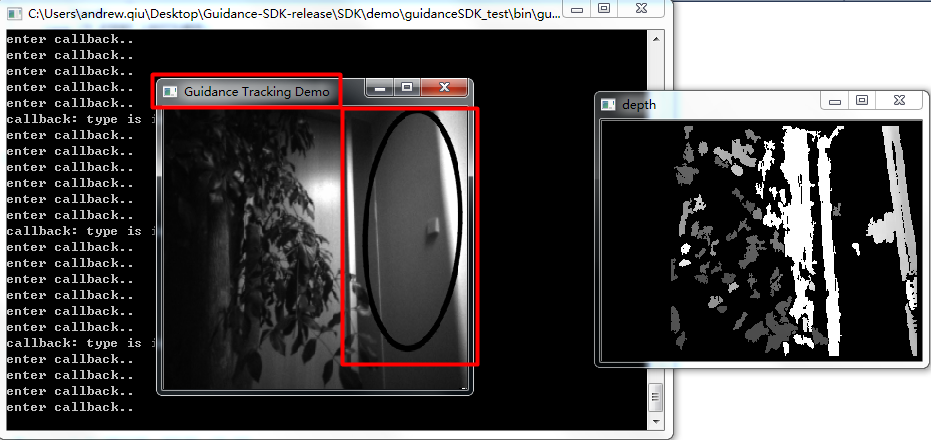 

 Figure.20 User select the object to tracking within the window of “Guidance Tracking Demo” 

   

 Figure.21 result.avi records the process of this program 

-	Now we define a callback function, which will be called when the subscribed data comes. **Users should only write light-weight processing functions in the callback function, such as data copy and display, otherwise the data transfer frequency will be slowed down.**

		Mat g_imleft(HEIGHT, WIDTH, CV_8U);
		Mat g_imright(HEIGHT, WIDTH, CV_8U);
		Mat g_depth(HEIGHT, WIDTH, CV_16SC1);
		e_vbus_index selected_vbus = e_vbus1;  // select front vbus
		string winDemoName = "Guidance Tracking Demo";

		int my_callback( int data_type, int data_len, char *content )
		{
		    		printf("enter callback..\n");
		    		g_lock.enter();
		    		if ( e_image == data_type && NULL != content )
		    		{
		        		printf("callback: type is image..\n");
		        		image_data data;
		        		memcpy((char*)&data, content, sizeof(data));
		        		memcpy(g_imleft.data, data.m_greyscale_image_left[selected_vbus], IMAGE_SIZE);
		        		memcpy(g_imright.data, data.m_greyscale_image_right[selected_vbus], IMAGE_SIZE);
		        		memcpy(g_depth.data, data.m_depth_image[selected_vbus], IMAGE_SIZE * 2);
		    		}
		    		g_lock.leave();
		    		g_event.set_event();
		    		return 0;
		}

-	Most Guidance SDK functions return an **int** type error code, non-zero if functions called fail, e.g. **init_transfer()**, **start_tansfer()**, which enables the user to determine the reason when error occurs. Here we write two macros, to print the error code or directly quit the program if error occurs.

		#define RETURN_IF_ERR(err_code) { if( err_code ){ printf( "USB error code:%d in file %s %d\n", err_code, __FILE__, __LINE__ );}}
		
		#define RELEASE_IF_ERR(err_code) { if( err_code ){ release_transfer(); printf( "USB error code:%d in file %s %d\n", err_code, __FILE__, __LINE__ );}}

-	Initialization, data subscription, data transfer start, image process, data transfer release and so on in main function.

		int main( int argc, const char** argv )
		{
		    /* help */
		    if(argc>1)
		        help();
		
		    /* Ready to write video */
		    VideoWriter vWriter("result.avi", CV_FOURCC('M','J','P','G'), 25, Size(WIDTH, HEIGHT), false);
		    /* tracking box */
		    Rect trackWindow;
		    int hsize[] = {16, 16};
		    float hranges[] = {0, 255};
		    float dranges[] = {0, 255};
		    
		    const float* phranges[] = { hranges, dranges };
		
		    selection = Rect(10,10,100,100);
		    trackObject = 0;
		
		    namedWindow( winDemoName, 0 );
		    /* set mouse event callback */
		    setMouseCallback( winDemoName, onMouse, 0 );
		
		    Mat imcolor, mask, hist, hist_of_object, backproj;
		    bool paused = false;
		    float hist_update_ratio = 0.2f;
		
		    /* Reset the configuration of data transfer */
		    reset_config();
		    int err_code = init_transfer();
		    RETURN_IF_ERR(err_code);
		    /* subscribes left grey-image of selected_vbus */    
		    err_code = select_greyscale_image(selected_vbus, true);
		    RELEASE_IF_ERR(err_code);
		    /* subscribes right grey-image of selected_vbus */    
		    err_code = select_greyscale_image(selected_vbus, false);
		    RELEASE_IF_ERR(err_code);
		    /* subscribes depth image of selected_vbus */
		    err_code = select_depth_image(selected_vbus);
		    RELEASE_IF_ERR(err_code);
		    /* set callback of data transfer */
		    err_code = set_sdk_event_handler(my_callback);
		    RELEASE_IF_ERR(err_code);
		    /* start data transfer */
		    err_code = start_transfer();
		    RELEASE_IF_ERR(err_code);
		
		    Mat depth(HEIGHT, WIDTH, CV_8UC1);
		    /* set loops of data transfer */
		    for( int times = 0; times < 30000; ++times )
		    {
		        /* wait until data comes */
		        g_event.wait_event();
		
		        // filter depth image
		        filterSpeckles(g_depth, -16, 50, 20);
		        // convert 16 bit depth image to 8 bit
		        g_depth.convertTo(depth, CV_8UC1);
		        /* depth image show */
		        imshow("depth", depth);
		        waitKey(1);
		        /* copy the grey-image to image */
		        g_imleft.copyTo(image);
		
		        if( !paused )
		        {
		            vector<Mat> ims(3);
		            ims[0] = image;
		            ims[1] = ims[2] = depth;
		            merge(ims, imcolor);
		            /* start tracking if object selected */
		            if( trackObject )
		            {
		                int ch[] = {0,1};
		                if( trackObject < 0 )
		                {
		                    Mat roi(imcolor, selection);
		                    
		                    calcHist(&roi, 1, &ch[0], Mat(), hist, 2, &hsize[0], &phranges[0]);
		                    normalize(hist, hist, 0, 255, CV_MINMAX);
		
		                    if(hist_of_object.empty())
		                        hist_of_object = hist;
		                    else
		                        hist_of_object = (1-hist_update_ratio)*hist_of_object + hist_update_ratio*hist;
		
		                    trackWindow = selection;
		                    trackObject = 1;
		                }
		
		                calcBackProject(&imcolor, 1, ch, hist_of_object, backproj, phranges);
		                RotatedRect trackBox = CamShift(backproj, trackWindow,
		                                    TermCriteria( CV_TERMCRIT_EPS | CV_TERMCRIT_ITER, 10, 1 ));
		                
		                if (trackWindow.area() <= 1)
		                {
		                    int cols = backproj.cols, rows = backproj.rows, r = (MIN(cols, rows) + 5)/6;
		                    trackWindow = Rect(trackWindow.x - r, trackWindow.y - r,
		                                       trackWindow.x + r, trackWindow.y + r) &
		                                  Rect(0, 0, cols, rows);
		                }
		                if( trackWindow.area() <= 1 )
		                    break;
		
		                ellipse( image, trackBox, Scalar(0,0,255), 3, CV_AA );
		            }
		            else if( trackObject < 0 )
		            {
		                paused = false;
		            }
		        }
		
		        if( selectObject && selection.width > 0 && selection.height > 0 )
		        {
		            Mat roi(image, selection);
		            bitwise_not(roi, roi);
		        }
		
		        imshow( winDemoName, image );
		        vWriter<<image;
		
		        char c = (char)waitKey(10);
		        /* press ‘q’ to quit program */
		        if( c == 27 || c=='q')
		        {
		            break;
		        }
		        switch(c)
		        {
		        case 'c':
		            trackObject = 0;            
		            break;
		        case 'p':
		        case ' ':
		            paused = !paused;
		            break;
		        default:
		            ;
		        }
		    }
		    /* stop data transfer */
		    err_code = stop_transfer();
		    RELEASE_IF_ERR(err_code);
		    /* make sure data transfer stopped */
		    sleep(100000);
		    /* release data transfer thread */
		    err_code = release_transfer();
		    RETURN_IF_ERR(err_code);
		
		    return 0;
		}

---

##### 5 Build and Run
>*Make sure the environment has been set up properly.* 

One can click the **“Build”** and then **“Start Debugging”** after connecting and starting the Guidance. 

---

#### Linux
##### 1 Create a directory
Create a directory **“SDK\demo\guidanceSDK\_test\camshiftDemo”**, Copy **DJI\_utility.cpp**, **DJI\_utility.h** and **main.cpp** to here，which is similar as in Windows.
 
   

 Figure.22 Copy DJI\_utility.cpp\DJI\_utility.h\main.cpp 

---

##### 2 Place libDJI\_guidance.so
Suppose the operating system is **Ubuntu14.04 32bit**. We copy the **libDJI\_guidance.so** in **SDK/so/x86** to **usr/local/lib**, notice that `sudo` is necessary to copy these files to usr/local/lib. 
 
   

 Figure.23 path of guidance dynamic library 

   

 Figure.24 Copy libDJI\_guidance.so to usr\local\lib 

---

##### 3 Edit Makefile
Edit a Makefile, check the include and library path of guidance SDK first；

 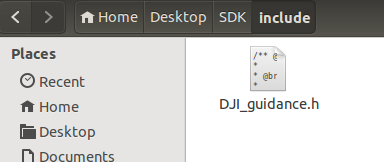 

 Figure.25 include path of guidance 

Create and edit the Makefile in directory **“camshiftDemo”**. Make sure OpenCV has been installed.

  

 Figure.26 Add a Makefile 

Code of Makefile: 

		#define a compiler
		CXX     = g++
		#define target name
		TARGET  = main
		#define dependencies of target 
		OBJECTS = main.o DJI_utility.o
		#define the Include and Library path
		CFLAGS  = -g -Wall -I/usr/local/include -I../../../include
		LDFLAGS = -Wl,-rpath,./ -lpthread -lrt -L./ -L/usr/local/lib/ -lDJI_guidance -lusb-1.0 `pkg-config --cflags --libs opencv` 
		
		$(TARGET) : $(OBJECTS)
		    $(CXX) -o $(TARGET) $(OBJECTS) $(LDFLAGS)
		main.o : main.cpp DJI_utility.h
		    $(CXX) $(CFLAGS) -c main.cpp DJI_utility.h
		DJI_utility.o : DJI_utility.cpp DJI_utility.h
		    $(CXX) $(CFLAGS) -c DJI_utility.cpp DJI_utility.h
		clean:
		    rm -rf *.o *.gch *.avi $(TARGET)

##### 4 Make and run
`cd` to **“camshiftDemo”** directory, and type command `make`, then power up Guidance, connect it to computer via USB, and run `sudo ./main`. Draw the object box with mouse when program is running. One could see pictures as follows if everything goes well. Typing `q` on keyboard will quit the program. 
 
  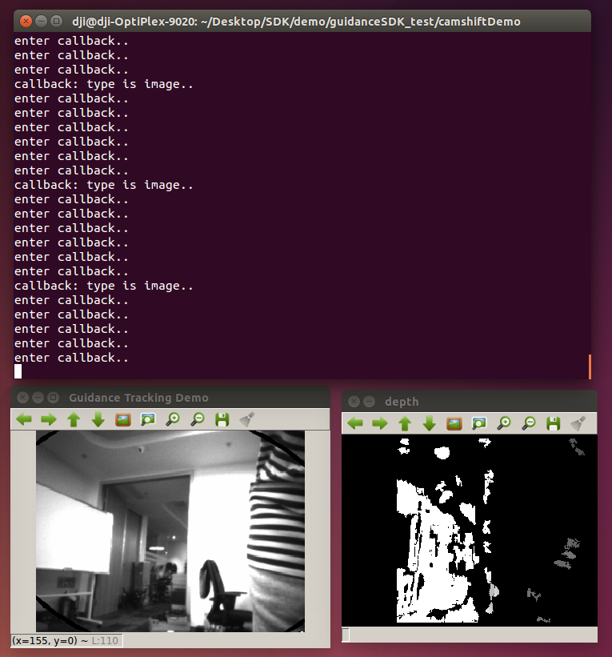 

